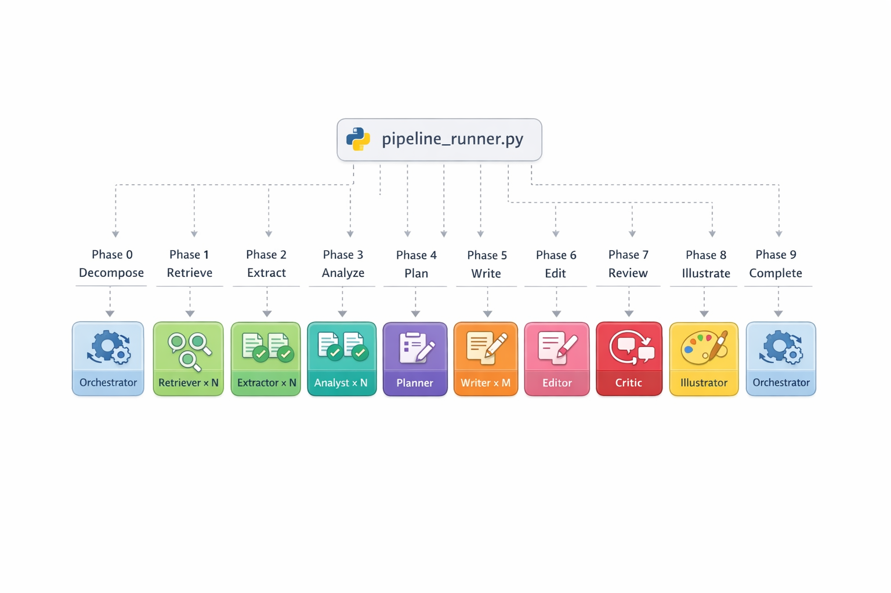
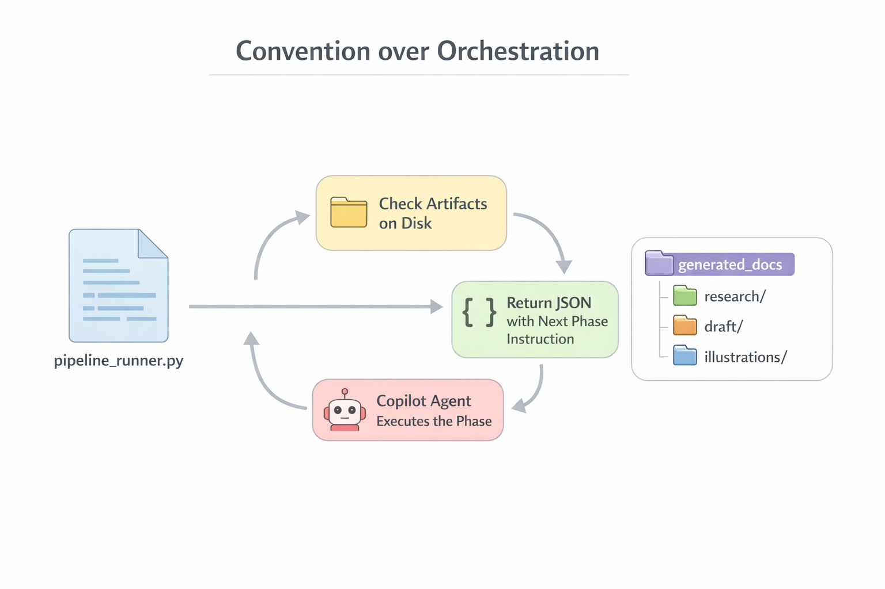

# Deep Analyst

Multi-agent research pipeline for GitHub Copilot. Automates deep research, structured synthesis, publication-quality illustration generation, and peer review — producing analytical documents ready for human consumption.

Built on GitHub Copilot agent mode with **11 specialized agents** coordinated through a **deterministic Python-driven pipeline** (`pipeline_runner.py`). The key principle: **Python code decides what happens next, LLM agents only execute their specific task.**



---

## Architecture: Convention over Orchestration

The central insight — borrowed from [PaperBanana](https://github.com/llmsresearch/paperbanana) — is that **LLM agents should never decide the pipeline flow**. A Python script (`pipeline_runner.py`) checks artifacts on disk and deterministically routes to the next phase. Copilot agents are pure executors.



### How It Works

```
while True:
    result = pipeline_runner.py next $BASE_FOLDER   # Python checks files on disk
    match result.action:
        case "orchestrator_search":  do_search(result.searches)       # Orchestrator searches directly
        case "orchestrator_extract": do_extract(result.extractions)   # Orchestrator extracts directly
        case "launch_parallel":      for a in result.agents:          # Launch N sub-agents
                                         runSubagent(a.name, a.prompt)
                                         write_file(a.output_file)
        case "launch_single":        runSubagent(result.agent, result.prompt)
        case "complete":             break
```

**Why this matters:**
- **Deterministic** — same artifacts on disk → same next phase, every time
- **Resumable** — pipeline can crash and restart from where it left off
- **Debuggable** — `pipeline_runner.py status` shows exactly where things stand
- **No LLM drift** — orchestrator agent doesn't "forget" steps or reorder phases

---

## The 10-Phase Pipeline

| Phase | Agent(s) | Parallel | What happens |
|-------|----------|----------|-------------|
| **0. Decompose** | Orchestrator | — | Parse user query → `params.md` + subtopic list |
| **1. Retrieve** | Retriever × N | ✅ | Discover URLs per subtopic → `_links.md` |
| **2. Extract** | Extractor × N | ✅ | Deep content extraction from URLs → `extract_*.md` |
| **3. Analyze** | Analyst × N | ✅ | Per-topic structure analysis → `_structure.md` |
| **4. Plan** | Planner × 1 | — | Merge structures into unified ToC → `toc.md` |
| **5. Write** | Writer × M | ✅ | Write sections from ToC assignments → `_sections/*.md` |
| **6. Edit** | Editor × 1 | — | Merge sections into cohesive document → `draft/v1.md` |
| **7. Review** | Critic × 1 | — | Evaluate draft → APPROVED / REVISE verdict |
| **8. Illustrate** | Illustrator × 1 | — | Generate PaperBanana PNGs → `illustrations/*.png` |
| **9. Complete** | Orchestrator | — | Log completion, report to user |

Phases 1, 2, 3, 5 run **in parallel** — one agent instance per subtopic/section.
Phase 7 → 5 creates a **revision loop**: if the Critic says REVISE, Writers rewrite flagged sections.

---

## Agents

| Agent | Description |
|-------|-------------|
| **Deterministic Orchestrator** | Python-driven pipeline controller. Uses `pipeline_runner.py` for phase sequencing and artifact validation. The agent is a dumb executor — the Python script is the brain. |
| **Research Orchestrator** | Legacy orchestrator with LLM-driven scheduling. Decomposes topics, manages 10 phases. Being replaced by Deterministic Orchestrator. |
| **Retriever** | Search-only agent — discovers URLs for a single subtopic using Tavily, GitHub, HuggingFace. No content extraction. |
| **Extractor** | Deep content extraction — reads URLs from `_links.md` and extracts full content into structured extract files via `tavily_extract` / `fetch_webpage`. |
| **Analyst** | Per-topic structure analysis — reads all extracts for one subtopic, proposes sections, assesses depth, maps sources. |
| **Planner** | Document architect — merges all per-topic structures into a unified Table of Contents with page budgets and source assignments. |
| **Writer** | Per-section content writer — writes one document section from ToC assignment, source extracts, and style parameters. |
| **Editor** | Document assembler — merges all section files into a single cohesive document with transitions, dedup, and executive summary. |
| **Critic** | Formalized document reviewer — evaluates draft quality and produces structured APPROVED/REVISE verdict with per-section feedback. |
| **Illustrator** | Publication-quality illustration generator using PaperBanana (`llmsresearch/paperbanana`) — supports both full pipeline (Retriever→Planner→Stylist→Visualizer↔Critic) and direct `gpt-image-1.5` mode. |
| **PDF Exporter** | Converts final Markdown document to PDF with embedded images. |

---

## Deterministic Pipeline Runner

The brain of the system is `pipeline_runner.py` — a pure Python script with zero LLM calls. **You don't run it directly** — the Deterministic Orchestrator agent calls it automatically in a loop. These CLI commands are for debugging:

```bash
# Show full pipeline status (which phases are done, word counts, etc.)
python3 .github/scripts/pipeline_runner.py status generated_docs_20260308_133227

# Check what phase comes next (returns JSON with action + prompts)
python3 .github/scripts/pipeline_runner.py next generated_docs_20260308_133227

# Initialize a new research folder (orchestrator does this automatically)
python3 .github/scripts/pipeline_runner.py init
```

**Example output of `next`:**
```json
{
  "action": "launch_parallel",
  "phase": 3,
  "phase_name": "Analysis",
  "agent_count": 2,
  "agents": [
    {
      "name": "Analyst",
      "prompt": "You are a research Analyst. Analyze extracted content for subtopic 'claude_code'...\nRead ALL extract_*.md files in: .../research/claude_code/\n...",
      "output_file": "research/claude_code/_structure.md",
      "description": "Analyze claude_code"
    },
    {
      "name": "Analyst",
      "prompt": "You are a research Analyst. Analyze extracted content for subtopic 'copilot_agents'...\n...",
      "output_file": "research/copilot_agents/_structure.md",
      "description": "Analyze copilot_agents"
    }
  ]
}
```

The script generates the exact prompt for each sub-agent. The orchestrator reads this JSON, calls `runSubagent(name, prompt)`, and writes the returned text to `output_file` — no interpretation, no creativity, no drift.

---

## Research Parameters

All parameters are **optional** — the Orchestrator parses what it can from the query and applies defaults. **It never asks the user.**

| Parameter | Values | Default | Description |
|-----------|--------|---------|-------------|
| **Size** | `brief` (5-8 pages), `standard` (15-20 pages), `detailed` (25-30 pages) | `standard` | Controls document length |
| **Language** | Any | Detected from query text | Output language matches the query language |
| **Audience** | `technical`, `executive`, `general` | Inferred from context | Determines depth and jargon level |
| **Tone** | `academic`, `business`, `conversational` | Inferred from context | Writing style |

---

## PaperBanana Illustration System

All illustrations are generated as **publication-quality PNG diagrams** using the [PaperBanana](https://github.com/llmsresearch/paperbanana) package — no Mermaid, no code-based diagrams, no screenshots.

**Two modes:**

| Mode | When to use | How |
|------|-------------|-----|
| **`--direct`** (default) | Architecture, pipeline, comparison, flowchart diagrams | Short 2-4 sentence prompt → `gpt-image-1.5` |
| **Full pipeline** | Statistical plots, data visualizations | Retriever→Planner→Stylist→Visualizer↔Critic |

**`--direct` mode** is used for 90%+ of illustrations because the full pipeline's Planner generates verbose text descriptions that cause the Visualizer to produce ASCII-art-like output instead of clean graphics.

**Visual style:** Clean vector infographic, white background, soft pastel color fills, rounded rectangles, sans-serif labels, directional arrows. Looks like a polished Figma/Lucidchart export.

---

## Typical Use Cases

In VS Code Copilot Chat, select **Deterministic Orchestrator** from the agent picker, then type your query:

### Comparative Analysis
```
Compare GitHub Copilot Agents, Claude Code, and OpenAI Codex CLI.
Size: detailed, Language: Russian
```

### Technology Overview
```
What is WebAssembly and how does it work?
```

### State of the Art
```
Current state of RAG systems in 2026
```

### Quick Research
```
What is LoRA? Size: brief
```

---

## Output Structure

Each pipeline run creates a timestamped folder:

```
generated_docs_YYYYMMDD_HHMMSS/
├── workflow_log.md                  # Pipeline execution log with timestamps
├── research/
│   ├── _plan/
│   │   ├── params.md               # Parsed research parameters
│   │   └── toc.md                  # Unified Table of Contents (Phase 4)
│   ├── {subtopic}/
│   │   ├── _links.md               # Discovered URLs (Phase 1)
│   │   ├── extract_*.md            # Extracted content (Phase 2)
│   │   └── _structure.md           # Topic structure analysis (Phase 3)
│   └── _sections/
│       ├── 01_introduction.md      # Written sections (Phase 5)
│       ├── 02_architecture.md
│       └── ...
├── draft/
│   ├── v1.md                       # Merged document (Phase 6)
│   ├── _review.md                  # Critic verdict (Phase 7)
│   └── v2.md                       # Revised version (if REVISE)
├── illustrations/
│   ├── _manifest.md                # Diagram metadata
│   └── *.png                       # PaperBanana illustrations (Phase 8)
└── agent_trace.jsonl                # Per-step debug trace
```

---

## Setup

1. Clone the repo
2. Copy `.env.example` → `.env` and add your OpenAI API key:
   ```
   OPENAI_API_KEY=sk-...
   ```
3. Install Python dependencies:
   ```bash
   pip install "paperbanana[openai]" python-dotenv
   ```
4. Open in VS Code with GitHub Copilot extension (agent mode required)
5. Configure MCP servers in VS Code settings:
   - **Tavily** (required) — web search and content extraction
   - **GitHub** (recommended) — repository search, code exploration
   - **HuggingFace** (optional) — paper/model search

## Requirements

- VS Code with GitHub Copilot (agent mode)
- Python 3.10+
- OpenAI API key (for `gpt-image-1.5` illustrations)
- MCP servers: Tavily (required), GitHub (recommended), HuggingFace (optional)

## License

MIT
