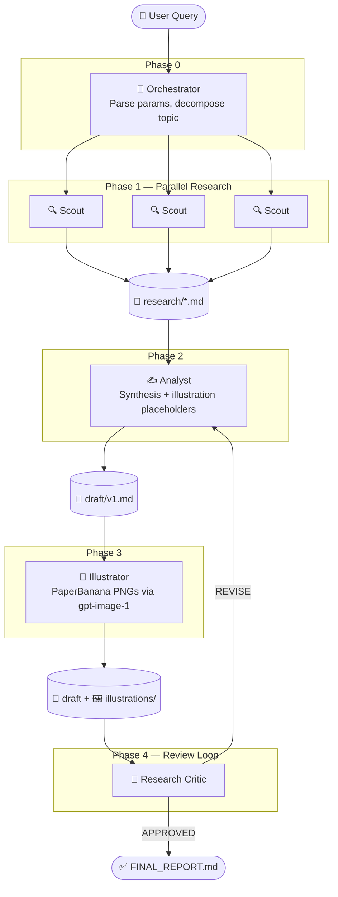
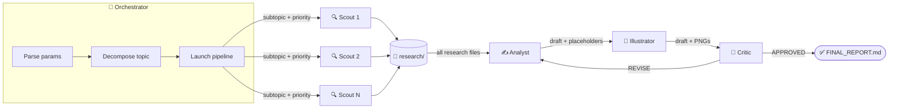

# Deep Analyst

Multi-agent research pipeline for GitHub Copilot. Automates deep research, structured synthesis, publication-quality illustration generation, and peer review — producing analytical documents ready for human consumption.

Built on GitHub Copilot agent mode with 6 specialized agents coordinated through a strict phase-based pipeline.

---

## How It Works

The user submits a research query in Copilot Chat. The **Research Orchestrator** parses it, decomposes the topic into subtopics, and launches the pipeline:



**Key design decisions:**
- Agents are **specialized**: each does one thing well (search / write / draw / review)
- Scout runs **in parallel** — one instance per subtopic, all at once
- Critic creates an **iterative feedback loop** — draft quality improves with each round
- Orchestrator **never asks** for missing parameters — it applies sensible defaults

---

## Agents

| Agent | Purpose | Input | Output |
|-------|---------|-------|--------|
| **Research Orchestrator** | Coordinates the entire pipeline. Decomposes topics into subtopics, assigns priorities, launches agents in sequence, manages Critic iterations | User query | `workflow_log.md`, orchestration decisions |
| **Scout** | Gathers raw data from the web. Uses Tavily (3-tier search), Context7 (library docs), GitHub (repos/code), HuggingFace (papers/models) | Subtopic + priority | `research/subtopic_N.md` — structured facts, data, sources |
| **Analyst** | Synthesizes Scout research into a structured analytical document. Builds comparison tables, draws conclusions, inserts illustration placeholders | Research files + params | `draft/vN.md` — full document draft |
| **Illustrator** | Generates publication-quality PNG diagrams using the PaperBanana method. Reads Analyst's placeholders, creates Golden Schema prompts, generates via gpt-image-1 | Draft with placeholders | `illustrations/*.png` + updated draft |
| **Research Critic** | Peer review. Checks logical coherence, source quality, topic coverage, illustration relevance. Returns structured verdict with severity-tagged issues | Draft + research + manifest | Verdict: APPROVED / REVISE / REJECTED |
| **PDF Exporter** | Converts the final Markdown document to PDF, verifying all image references resolve | Final draft | PDF file |

### Agent Interaction Flow



---

## Research Parameters

All parameters are **optional** — the Orchestrator parses what it can from the query and applies defaults for the rest. **It never asks the user.**

| Parameter | Values | Default | Description |
|-----------|--------|---------|-------------|
| **Document type** | `comparison`, `overview`, `sota`, `report` | Auto-detected from query | Determines document template and structure |
| **Size** | `brief` (15-20 pages), `standard` (30-40 pages), `detailed` (60-100 pages) | `standard` | Controls document length. Includes illustrations. |
| **Search depth** | `quick`, `normal`, `deep` | Auto-derived from size | Controls Tavily search aggressiveness (see below) |
| **Illustrations** | `on` / `off` | Always ON | Disable only with explicit `no illustrations` / `text only` |
| **Language** | Any | Detected from query text | Output language matches the query language |

### Search Depth → Tavily Behavior

Search depth controls how deep each Scout goes:

| Depth | Subtopic Priorities | Tavily Tiers | `tavily_research` |
|-------|--------------------|--------------|--------------------|
| `quick` | All `quick` | Level 1 only (basic, 5 results) | ❌ |
| `normal` | Mix `high` + `normal` | Levels 1-2 (basic + advanced) | ❌ |
| `deep` | **All `high`** | Levels 1-2-3 (full budget) | ✅ per subtopic |

**Auto-mapping when search depth is not set:**
- `brief` → `normal`
- `standard` → `normal`
- `detailed` → `deep` (all subtopics get full Tavily budget including `tavily_research`)

---

## PaperBanana Illustration System

All illustrations are generated as **publication-quality PNG diagrams** using the PaperBanana method — no Mermaid, no code-based diagrams, no screenshots.

**How it works:**

1. **Analyst** inserts `<!-- ILLUSTRATION -->` HTML comment placeholders in the draft with detailed descriptions (200+ chars each)
2. **Illustrator** parses these placeholders and creates **Golden Schema prompts** — zone-based structured prompts with layout configuration, zone definitions, and style meta-instructions
3. Each prompt generates **2-3 PNG candidates** via OpenAI `gpt-image-1` (1536×1024, quality=high)
4. Illustrator selects the best candidate per diagram and **replaces the placeholder** in the draft with an image reference

**Visual style:** NeurIPS 2025 academic aesthetic — flat vector, 2D, white background, pastel palette, clean typography. No gradients, no 3D, no photo-realism.

**Diagram language:** All text labels and annotations inside diagrams are generated **in the document language**. If the document is in Russian → diagram labels in Russian. The prompt structure itself is always in English (gpt-image-1 works best with English instructions).

**Placeholder format (written by Analyst):**
```markdown
<!-- ILLUSTRATION: type=architecture, section="§2. System Architecture",
     description="Three-column layout showing Copilot Agents (left), Claude Code (center),
     OpenAI Codex (right). Each column contains stacked boxes: IDE layer, Agent layer,
     Tool layer, Execution layer. Arrows show data flow between layers..." -->

*[Рис. 1. Architecture comparison of three AI agent platforms]*
```

---

## Typical Use Cases

### Comparative Analysis
```
@research-orchestrator
Compare GitHub Copilot Agents, Claude Code, and OpenAI Codex CLI.
Type: comparative analysis, Language: Russian, Size: detailed
```
→ 60-100 page document with per-platform deep dives, comparison tables, architecture diagrams, pros/cons, scenario-based recommendations.

### Technology Overview
```
@research-orchestrator
What is WebAssembly and how does it work?
```
→ 30-40 page overview with architecture diagram, execution pipeline, ecosystem map, practical applications.

### State of the Art
```
@research-orchestrator
Current state of RAG systems in 2026. Size: standard
```
→ Review of leading RAG approaches, evolution timeline, benchmarks, method taxonomy diagram.

### Quick Research
```
@research-orchestrator
What is LoRA? Size: brief, search depth: quick
```
→ 15-20 page concise overview with key concepts, minimal search time.

### Non-English Research
```
@research-orchestrator
Сравнение фреймворков для fine-tuning LLM: LoRA, QLoRA, DoRA
```
→ Full analysis in Russian (language auto-detected from query).

---

## Output Structure

Each pipeline run creates a timestamped folder:

```
generated_docs_YYYYMMDD_HHMMSS/
├── workflow_log.md              # Full pipeline execution log with timestamps
├── research/                    # Raw Scout findings (one file per subtopic)
│   ├── github_copilot_agents.md
│   ├── claude_code.md
│   └── openai_codex_cli.md
├── draft/                       # Document versions
│   ├── v1.md                    # Initial Analyst draft
│   └── v2.md                    # Post-Critic revision (if needed)
├── illustrations/               # PaperBanana PNG diagrams
│   ├── _manifest.md             # Diagram metadata and prompts used
│   ├── diagram_1.png            # Final selected illustration
│   ├── diagram_1_a.png          # Candidate A (kept for audit)
│   └── ...
└── FINAL_REPORT.md              # Approved document (copy of best draft version)
```

---

## Setup

1. Clone the repo
2. Copy `.env.example` → `.env` and add your OpenAI API key:
   ```
   OPENAI_API_KEY=sk-...
   ```
3. Open in VS Code with GitHub Copilot extension (agent mode required)
4. Configure MCP servers in VS Code settings:
   - **Tavily** (required) — web search
   - **Context7** (recommended) — library/framework documentation
   - **GitHub** (optional) — repository search, code exploration
   - **HuggingFace** (optional) — paper/model search

## Requirements

- VS Code with GitHub Copilot (agent mode)
- Python 3.10+
- OpenAI API key (for `gpt-image-1` illustrations)
- MCP servers: Tavily (required), Context7 (recommended), GitHub & HuggingFace (optional)

## License

MIT
