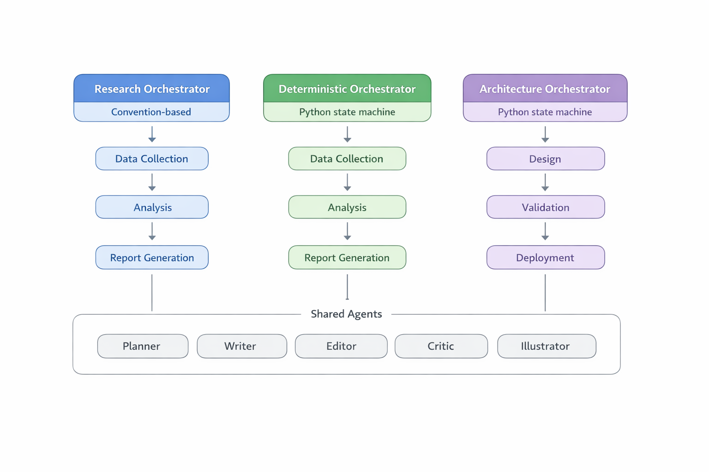
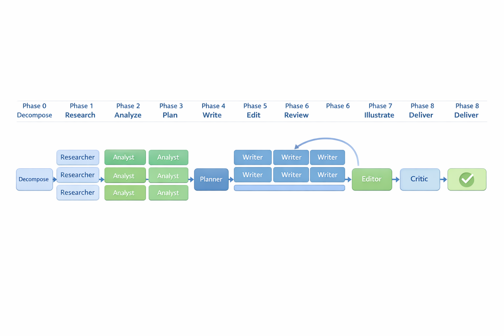
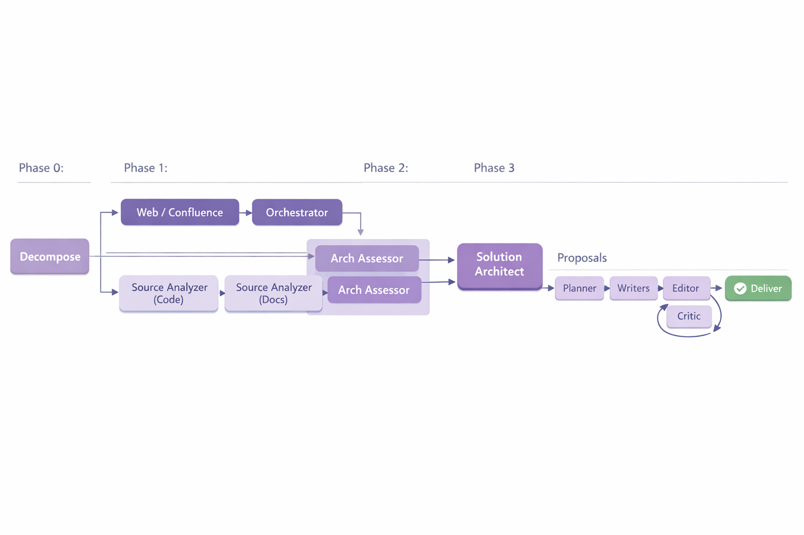

# Deep Analyst

Multi-agent platform for GitHub Copilot that produces publication-quality analytical documents and architecture proposals. Three orchestrators, 15 specialized agents, two Python state machines, and the PaperBanana illustration system.



---

## Three Orchestrators

Deep Analyst provides three entry points — each is a fully automated pipeline producing a polished document from a single user prompt.

| | **Research Orchestrator** | **Deterministic Orchestrator** | **Architecture Orchestrator** |
|---|---|---|---|
| **Entry point** | `@research-orchestrator` | `@deterministic-orchestrator` | `@architecture-orchestrator` |
| **Scheduling** | Convention-based (agent decides) | Python state machine (`pipeline_runner.py`) | Python state machine (`arch_pipeline_runner.py`) |
| **Input** | Research question / topic | Research question / topic | Code, docs, configs, Confluence, web |
| **Output** | Analytical document (5–30 pages) | Analytical document (5–30 pages) | Architecture proposal with options & trade-offs |
| **Folder prefix** | `generated_docs_*` | `generated_docs_*` | `generated_arch_*` |
| **Phases** | 0–8 | 0–8 | 0–9 |

### Two scheduling models

The Research and Deterministic orchestrators produce **the same output** using the same sub-agents, but differ in how they schedule work:

- **Convention over Orchestration** (`@research-orchestrator`): The orchestrator agent is "smart" — it reads instruction files, decides next phase, constructs sub-agent prompts, and validates outputs. No Python script involved.
- **Deterministic Pipeline** (`@deterministic-orchestrator`): The Python script is the brain — it returns JSON with the next action, agent name, exact prompt, and output path. The orchestrator agent is a "dumb executor" that never makes decisions.

The deterministic approach is more reliable for complex documents — the state machine handles retries, validation thresholds, and phase transitions predictably.

### Shared components

All three pipelines share these agents and infrastructure:
- **Planner** — builds Table of Contents with page budgets
- **Writer** (Opus) — writes one section at a time from source material
- **Editor** (Opus) — merges sections, deduplicates, adds transitions
- **Critic** — structured review with APPROVED / REVISE verdict
- **Illustrator** — PaperBanana PNG generation via `gpt-image-1.5`
- **PDF Exporter** — Markdown → PDF conversion
- **Confluence Publisher** — publishes to Confluence with images via REST API

---

## Orchestrator 1: Research (Convention-based)

The **Research Orchestrator** takes a topic, searches the web, extracts full content from sources, and produces a structured analytical document. The agent itself manages phase transitions by following instruction files.



### How to use

```
@research-orchestrator
Compare GitHub Copilot Agents, Claude Code, and OpenAI Codex CLI.
Type: comparative analysis, Language: Russian, Size: detailed
```

### Phases

| Phase | Agent | Action | Output |
|-------|-------|--------|--------|
| 0 | Orchestrator | Parse query → `params.md` with subtopics | `research/_plan/params.md` |
| 1 | Researcher ×N | Search + extract per subtopic (parallel) | `research/{subtopic}/_links.md` + `extract_*.md` |
| 2 | Analyst ×N | Analyze extracts per subtopic → section proposals | `research/{subtopic}/_structure.md` |
| 3 | Planner | Build unified Table of Contents | `research/_plan/toc.md` |
| 4 | Writer ×M | Write sections in parallel (one per ToC entry) | `draft/_sections/NN_*.md` |
| 5 | Editor | Merge all sections into cohesive document | `draft/v1.md` |
| 6 | Critic | Review → APPROVED or REVISE (max 2 loops) | `draft/_review.md` |
| 7 | Illustrator | Generate PNGs via PaperBanana, embed in draft | `illustrations/*.png` |
| 8 | — | Delivery: stats, paths, next steps | — |

---

## Orchestrator 2: Deterministic (Python state machine)

The **Deterministic Orchestrator** runs the same research pipeline but with `pipeline_runner.py` controlling every decision. The agent calls `pipeline_runner.py next` in a loop and executes whatever JSON action it returns.

### How to use

```
@deterministic-orchestrator
LLM inference optimization: KV-cache, speculative decoding, quantization.
Size: detailed, Language: Russian
```

### Execution loop

```
LOOP:
  result = pipeline_runner.py next {BASE_FOLDER}   → JSON action
  
  switch action.type:
    "orchestrator_search"   → orchestrator does web search directly
    "orchestrator_extract"  → orchestrator fetches URLs directly
    "launch_parallel"       → ALL runSubagent calls in ONE batch (concurrent)
    "launch_single"         → one sub-agent, wait for result, write to output_file
    "orchestrator_illustrate" → orchestrator runs PaperBanana directly
    "complete"              → done
```

### Key differences from Research Orchestrator

| Aspect | Research Orchestrator | Deterministic Orchestrator |
|--------|----------------------|---------------------------|
| Phase transitions | Agent reads instructions | `pipeline_runner.py next` returns JSON |
| Sub-agent prompts | Agent constructs from templates | Script generates exact prompt text |
| Validation | Agent checks files manually | Script checks word counts, file counts, thresholds |
| Retries | Agent decides when to retry | Script returns retry actions automatically |
| Search/extraction | Sub-agents (Researcher) | Orchestrator does it directly (Phases 1–2) |
| Phases 3–7 | Same | Same (sub-agents return text → orchestrator writes) |

### Phases

Same 0–8 phases as the Research Orchestrator, but Phases 1–2 are handled differently:

| Phase | Handler | Action |
|-------|---------|--------|
| 0 | Orchestrator | Parse query → `params.md` |
| 1 | **Orchestrator (direct)** | Search cascade: Tavily → GitHub → HuggingFace → own knowledge |
| 2 | **Orchestrator (direct)** | Extract full content from discovered URLs via `fetch_webpage` |
| 3 | Analyst ×N (parallel) | Per-subtopic structure analysis |
| 4 | Planner | Build unified ToC |
| 5 | Writer ×M (parallel) | Write sections |
| 6 | Editor | Merge into `v1.md` |
| 7 | Critic | Review loop (max 2 iterations) |
| 8 | Illustrator / direct | Generate PNGs |

---

## Orchestrator 3: Architecture

The **Architecture Orchestrator** analyzes existing code, documentation, and infrastructure to produce architecture proposals with trade-offs, risk assessment, and migration paths. Driven by `arch_pipeline_runner.py`.



### How to use

```
@architecture-orchestrator
Redesign the LLM Orchestrator service. Improve modularity and testability.
Target: /path/to/repo, Size: standard, Language: Russian
```

### Sources

The pipeline supports 5 source types in `params.md`:

```markdown
## Sources
1. Main codebase — path: /repo/app — type: code
2. Infrastructure — path: /repo/docker-compose.yml — type: config
3. Architecture docs — path: /repo/docs — type: docs
4. Industry patterns — query: "microservices patterns" — type: web
5. Team wiki — confluence: space=ARCH, title=Current Design — type: confluence
```

| Type | Handler | What it does |
|------|---------|-------------|
| `code` | Source Analyzer (sub-agent) | Reads files, extracts module structure, APIs, patterns |
| `docs` | Source Analyzer (sub-agent) | Extracts ADRs, requirements, constraints |
| `config` | Source Analyzer (sub-agent) | Maps infrastructure topology, env vars, dependencies |
| `web` | Orchestrator (direct) | Fetches web pages, extracts content |
| `confluence` | Orchestrator (direct) | Reads Confluence pages via MCP/REST |

### Phases

| Phase | Agent | Action | Output |
|-------|-------|--------|--------|
| 0 | Orchestrator | Parse request → `params.md` with `## Sources` | `research/_plan/params.md` |
| 1a | Orchestrator | Fetch web / Confluence sources directly | `research/{area}/extract_*.md` |
| 1b | Source Analyzer ×N | Analyze code / docs / config in parallel | `research/{area}/extract_*.md` |
| 2 | Arch Assessor ×N | Per-area assessment: patterns, tech debt, dependencies | `research/{area}/_assessment.md` |
| 3 | Solution Architect | Design 2–3 architecture options with trade-offs | `research/_plan/_proposals.md` |
| 4 | Planner | Build ToC for proposal document | `research/_plan/toc.md` |
| 5 | Writer ×M | Write sections in parallel | `draft/_sections/NN_*.md` |
| 6 | Editor | Merge into cohesive document | `draft/v1.md` |
| 7 | Critic | Review with architecture-specific criteria | `draft/_review.md` |
| 8 | Illustrator | Generate architecture diagrams | `illustrations/*.png` |
| 9 | — | Delivery + optional Confluence publish / PDF export | — |

### Architecture-specific agents

| Agent | Model | Role |
|-------|-------|------|
| **Source Analyzer** | Sonnet | Scans code, docs, configs → structured extracts |
| **Arch Assessor** | Sonnet | Per-area architecture assessment (patterns, debt, risks) |
| **Solution Architect** | Opus | Synthesizes assessments → 2–3 proposals with recommendation |

---

## All Agents

| Agent | Model | Used by | Role |
|-------|-------|---------|------|
| **Research Orchestrator** | Sonnet | — | Convention-based research pipeline scheduler |
| **Deterministic Orchestrator** | Sonnet | — | Python-driven research pipeline executor |
| **Architecture Orchestrator** | Sonnet | — | Python-driven architecture pipeline executor |
| **Researcher** | Sonnet | Research | URL discovery + full content extraction per subtopic |
| **Analyst** | Sonnet | Research, Deterministic | Per-subtopic structure analysis |
| **Source Analyzer** | Sonnet | Architecture | Code/docs/config scanning → structured extracts |
| **Arch Assessor** | Sonnet | Architecture | Per-area architecture assessment |
| **Solution Architect** | Opus | Architecture | 2–3 architecture proposals with recommendation |
| **Planner** | Opus | All | Unified Table of Contents with page budgets |
| **Writer** | Opus | All | Per-section content writing |
| **Editor** | Opus | All | Section merge, dedup, transitions |
| **Critic** | Sonnet | All | Structured review → APPROVED / REVISE |
| **Illustrator** | Sonnet | All | PaperBanana PNG generation |
| **PDF Exporter** | — | Standalone | Markdown → PDF |
| **Confluence Publisher** | — | Standalone | Publish to Confluence with images |

---

## Core Design Principles

**Files = Protocol.** Agents communicate only through files on disk. No in-memory state sharing.

**Folders = Routing.** Each subtopic (research) or source area (architecture) gets its own folder under `research/`.

**Two scheduling models.** Convention-based (agent decides) or deterministic (Python script decides). Same sub-agents, same output format.

**Sub-agents return text (by design, not limitation).** Sub-agents CAN write files and use MCP tools, but the pipeline uses a centralized I/O pattern: most sub-agents return markdown text, and the orchestrator writes it to disk. This gives the orchestrator control over verification and logging. Exception: Researcher agents write their own files directly.

**Parallel execution.** VS Code spawns multiple `runSubagent` calls concurrently when they appear in a single tool-call batch. Phases 1, 2, 4 exploit this — each parallel agent writes to its own folder/file.

**Deterministic phases.** Each phase has validation gates. The state machine checks word counts, file existence, and structural integrity before advancing.

---

## PaperBanana Illustration System

All pipelines use **PaperBanana** (`llmsresearch/paperbanana`) to generate publication-quality PNG diagrams — no Mermaid, no ASCII art, no screenshots.

| Mode | When to use | Command |
|------|-------------|---------|
| `--direct` | Architecture diagrams, flowcharts, comparisons | `paperbanana_generate.py "prompt" "output.png" --direct` |
| `--context` | Data visualizations, methodology figures | `paperbanana_generate.py "desc" "output.png" --context "text"` |

**Models:** `gpt-image-1.5` (image generation), `gpt-5.2` (VLM planning/critique).

**Visual style:** NeurIPS academic aesthetic — flat vector, 2D, white background, pastel palette, clean typography.

**Placeholder format** (written by Writer, processed by Illustrator):
```markdown
<!-- ILLUSTRATION: type="architecture", section="§2", description="..." -->
```

---

## Publishing

### PDF Export
```
@pdf-exporter
Export generated_docs_20260310_120000/draft/v1.md to PDF
```

### Confluence Publish
```
@confluence-publisher
Publish generated_arch_20260310_150000/draft/v1.md
to space=ARCH, title=LLM Orchestrator Proposal
```
Confluence Publisher uses **REST API** for image uploads (MCP cannot upload images). Requires `CONFLUENCE_URL`, `CONFLUENCE_USER`, `CONFLUENCE_TOKEN` env vars.

---

## Parameters

All parameters are **optional** — sensible defaults are applied.

| Parameter | Values | Default |
|-----------|--------|---------|
| **Size** | `brief` (5–8p), `standard` (15–20p), `detailed` (25–30p) | `standard` (20 pages) |
| **Language** | Any | Auto-detected from query |
| **Document type** | `comparison`, `overview`, `sota`, `report` | Auto-detected |
| **Illustration mode** | `direct` (default), `pipeline`, `none` | `direct` |
| **Audience** | `technical`, `executive`, `general` | Inferred from context |
| **Tone** | `academic`, `business`, `conversational` | Inferred from context |

Page conversion: 1 page ≈ 300 words (Markdown with headings, code blocks, illustrations).

---

## Project Structure

```
.github/
  agents/                        # 15 agent definitions
    research-orchestrator.agent.md    # Convention-based research pipeline
    deterministic-orchestrator.agent.md  # Python-driven research pipeline
    architecture-orchestrator.agent.md   # Python-driven architecture pipeline
    researcher.agent.md           # URL discovery + content extraction
    analyst.agent.md              # Structure analysis
    source-analyzer.agent.md      # Code/docs/config scanning
    arch-assessor.agent.md        # Architecture assessment
    solution-architect.agent.md   # Proposal generation
    planner.agent.md              # ToC builder
    writer.agent.md               # Section writer
    editor.agent.md               # Document merger
    critic.agent.md               # Peer review
    illustrator.agent.md          # PNG generation
    pdf-exporter.agent.md         # PDF conversion
    confluence-publisher.agent.md  # Confluence publishing
  instructions/                   # Per-agent instruction files (12 files)
    shared/                       # Cross-agent conventions
    research-orchestrator/        # Workflow phases, topic decomposition
    researcher/                   # Research protocol, search strategy
    analyst/                      # Structure analysis rules
    planner/                      # ToC generation rules
    writer/                       # Section writing protocol
    editor/                       # Merge rules
    critic/                       # Verdict format
    illustrator/                  # Generation pipeline, style guidelines
    pdf-exporter/                 # Export pipeline
  scripts/
    pipeline_runner.py            # Research pipeline state machine
    arch_pipeline_runner.py       # Architecture pipeline state machine
    extract_url.py                # URL extraction utility
    merge_sections.py             # Section merge utility
    validate_agents.py            # Agent file validator
    test_pipeline.py              # Pipeline tests
  skills/
    image-generator/              # PaperBanana wrapper (paperbanana_generate.py)
    workflow-logger/              # Phase logging (workflow-logger.py, agent-trace.py)
    pdf-exporter/                 # PDF conversion scripts
docs/
  architecture-decisions.md       # 26 ADRs
  images/                         # README illustrations
scripts/
  publish_to_confluence.py        # Standalone Confluence publisher
generated_docs_*/                 # Research pipeline output folders
generated_arch_*/                 # Architecture pipeline output folders
```

---

## Quick Start

### Research document (convention-based)
```
@research-orchestrator
What is WebAssembly and how does it work? Size: standard
```

### Research document (deterministic)
```
@deterministic-orchestrator
LLM inference optimization: KV-cache, speculative decoding, quantization.
Size: detailed, Language: Russian
```

### Architecture proposal
```
@architecture-orchestrator
Redesign the authentication module. Improve security and testability.
Target: /path/to/project, Size: standard
```

### Continue an interrupted pipeline
```
@research-orchestrator continue generated_docs_20260310_120000
@architecture-orchestrator continue generated_arch_20260310_150000
```

Both pipelines checkpoint between phases — you can close the conversation and resume later in a new one..

---

## Output Structure

Each pipeline run creates a timestamped folder:

```
generated_docs_YYYYMMDD_HHMMSS/
├── workflow_log.md              # Full pipeline execution log with timestamps
├── research/
│   ├── _plan/
│   │   ├── params.md            # Topic, audience, subtopics (Phase 0)
│   │   └── toc.md               # Unified Table of Contents (Phase 3)
│   └── {subtopic_slug}/         # One folder per subtopic
│       ├── _links.md            # Discovered URLs (Phase 1)
│       ├── extract_1.md         # Full extracted content (Phase 1)
│       ├── extract_N.md
│       └── _structure.md        # Analyst's depth assessment (Phase 2)
├── draft/
│   ├── _sections/
│   │   ├── 01_introduction.md   # Individual sections (Phase 4)
│   │   └── NN_slug.md
│   ├── v1.md                    # Merged document (Phase 5)
│   └── _review.md               # Critic's verdict (Phase 6)
└── illustrations/
    ├── _manifest.md             # Diagram metadata and prompts used
    └── diagram_*.png            # Generated illustrations (Phase 7)
```

---

## Setup

### Prerequisites

- **VS Code** 1.100+ with **GitHub Copilot** extension (agent mode)
- **Python 3.10+**
- **OpenAI API key** (for PaperBanana illustrations via `gpt-image-1.5`)

### 1. Clone the repo

```bash
git clone https://github.com/antonchirikalov/deep-analyst.git
```

### 2. Add to your project as a secondary workspace folder

Deep Analyst agents live inside `.github/agents/`. VS Code Copilot discovers agents from **all workspace folders**. Two ways to connect:

**Option A — Multi-root workspace (recommended):**

Open your project, then `File → Add Folder to Workspace…` → select the cloned `deep-analyst` folder. Save the workspace (`File → Save Workspace As…`). Now all 15 agents are available in Copilot Chat alongside your project files.

**Option B — Symlink `.github` into your project:**

```bash
# From your project root:
ln -s /path/to/deep-analyst/.github/agents .github/agents
ln -s /path/to/deep-analyst/.github/instructions .github/instructions
ln -s /path/to/deep-analyst/.github/scripts .github/scripts
ln -s /path/to/deep-analyst/.github/skills .github/skills
```

> **Note:** Option A is cleaner — no symlinks to maintain, easy to update with `git pull`.

### 3. Configure environment

```bash
cd deep-analyst
cp .env.example .env
# Edit .env — add your OpenAI API key:
# OPENAI_API_KEY=sk-...
```

### 4. Configure MCP servers

Add MCP servers to your VS Code settings (`settings.json`) or `.vscode/mcp.json`:

```jsonc
// .vscode/mcp.json (in your workspace)
{
  "servers": {
    "tavily": {
      "type": "http",
      "url": "https://mcp.tavily.com/mcp",
      "headers": { "Authorization": "Bearer YOUR_TAVILY_API_KEY" }
    },
    "github": {
      "command": "docker",
      "args": ["run", "-i", "--rm",
        "-e", "GITHUB_PERSONAL_ACCESS_TOKEN",
        "ghcr.io/github/github-mcp-server"],
      "env": { "GITHUB_PERSONAL_ACCESS_TOKEN": "ghp_..." }
    }
  }
}
```

| MCP Server | Purpose | Required? |
|------------|---------|-----------|
| **Tavily** | Web search + content extraction | Recommended (fallback: `fetch_webpage`) |
| **GitHub** | Repository search, code exploration | Optional |
| **HuggingFace** | Paper/model search | Optional |
| **Atlassian** | Confluence read/write | Only for Confluence publishing |

### 5. Verify agents are loaded

Open Copilot Chat (`Cmd+Shift+I`), type `@` and check that `research-orchestrator` and `architecture-orchestrator` appear in the agent list. If they don't — make sure the `deep-analyst` folder is in your workspace.

## License

MIT
